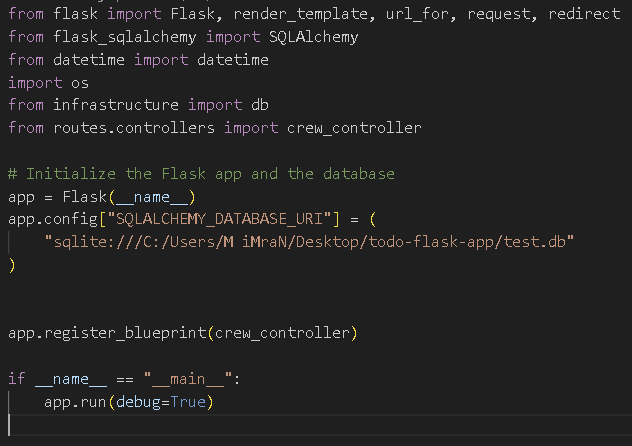
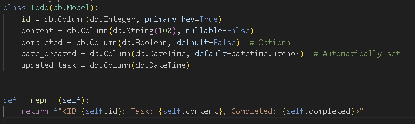
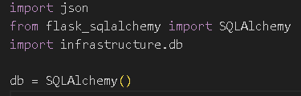

# Todo App

This is a Todo app Project, made to keep checks on tasks to do in daily lives.

## Installation

1. Clone the repository:

   ```bash
   git clone https://github.com/MuhammadImranTahir97/todo-app-flask
   ```

2. Navigate to the project directory:
   ```bash
   cd todo-app
   ```
3. Install dependencies:
   ```bash
   npm install
   ```

## Usage

To start the project, run:

```bash
npm start
```

## Screenshots






## Contributing

Contributions are welcome! Please follow these steps:

1.Fork the repository.
2.Create a new branch.
3.Make your changes.
4.Submit a pull request.

## License

This project is licensed under the MIT License - see the LICENSE file for details.

[MIT](https://choosealicense.com/licenses/mit/)

```

```
